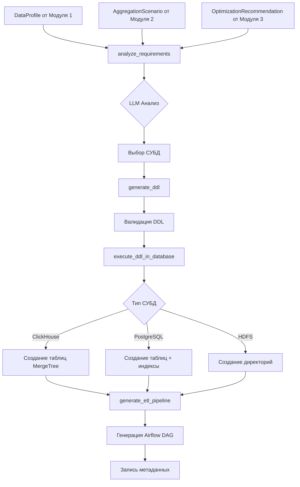

# МОДУЛЬ 4: ТЕХНИЧЕСКАЯ СХЕМА И ПОТОКИ ДАННЫХ

## СХЕМА ПОТОКА ДАННЫХ



## АРХИТЕКТУРА ПРИНЯТИЯ РЕШЕНИЙ

```
Входные данные → Эвристический анализ → LLM анализ → Финальное решение
                      ↓                    ↓              ↓
                 Базовые правила      ИИ рекомендации   Пользователь
                 (скоринг 0-1)       (обоснование)     (подтверждение)
```

## МАТРИЦА ПОДДЕРЖИВАЕМЫХ ОПТИМИЗАЦИЙ

| Оптимизация | ClickHouse | PostgreSQL | HDFS |
|-------------|------------|------------|------|
| Партиционирование | ✅ PARTITION BY | ✅ RANGE/LIST | ✅ Директории |
| Индексы | ✅ ORDER BY | ✅ CREATE INDEX | ❌ |
| Сжатие | ✅ LZ4/ZSTD | ✅ TOAST | ✅ Snappy/GZIP |
| Сортировка | ✅ ORDER BY | ✅ CLUSTER | ❌ |
| Формат данных | ✅ Native | ✅ Row-based | ✅ Parquet |

## СХЕМА БАЗЫ ДАННЫХ

```sql
-- Таблица дизайнов хранилищ
warehouse_designs (
    design_id UUID PRIMARY KEY,
    source_profile_id INTEGER REFERENCES data_profiles(id),
    status VARCHAR(50),  -- 'analyzing', 'ddl_generated', 'ddl_error'
    results JSONB,       -- Результаты анализа и DDL
    created_at TIMESTAMP,
    updated_at TIMESTAMP
);

-- Таблица экземпляров хранилищ
warehouse_instances (
    id SERIAL PRIMARY KEY,
    design_id UUID REFERENCES warehouse_designs(design_id),
    target_db_type VARCHAR(20),  -- 'clickhouse', 'postgres', 'hdfs'
    table_name VARCHAR(100),
    connection_info JSONB,
    created_at TIMESTAMP
);

-- Таблица рекомендаций оптимизации (из Модуля 3)
optimization_recommendations (
    id SERIAL PRIMARY KEY,
    table_name VARCHAR(255),
    recommendation_type VARCHAR(50),  -- 'partition', 'index', 'compression'
    recommendation_details JSONB,
    created_at TIMESTAMP,
    UNIQUE(table_name, recommendation_type)
);
```

## АЛГОРИТМ ВЫБОРА СУБД

### 1. Эвристический анализ (скоринг 0-1):

```python
def calculate_scores(context):
    scores = {"clickhouse": 0, "postgres": 0, "hdfs": 0}
    
    # Объем данных
    if est_rows > 10_000_000:
        scores["clickhouse"] += 0.4
        scores["hdfs"] += 0.3
    elif est_rows > 100_000:
        scores["clickhouse"] += 0.2
        scores["postgres"] += 0.3
    else:
        scores["postgres"] += 0.4
    
    # Тип запросов
    if "batch_processing" in query_patterns:
        scores["hdfs"] += 0.3
    if "real-time" in refresh_interval:
        scores["postgres"] += 0.3
    if "analytics" in query_patterns:
        scores["clickhouse"] += 0.4
    
    # Бюджет
    if budget == "low":
        scores["hdfs"] += 0.2
    elif budget == "high":
        scores["clickhouse"] += 0.2
        scores["postgres"] += 0.1
    
    return scores
```

### 2. LLM анализ:

```python
prompt = f"""
Проанализируй требования и выбери оптимальную СУБД:
- ClickHouse: OLAP, высокая производительность, колоночное хранение
- PostgreSQL: OLTP, ACID, реляционная модель
- HDFS: Big Data, горизонтальное масштабирование, низкая стоимость

Данные: {context}
Эвристическая оценка: {heuristic_scores}

Верни JSON: {{"final_choice": "...", "summary": "...", "confidence": "..."}}
"""
```

## ШАБЛОНЫ DDL

### ClickHouse Template:
```jinja2
CREATE DATABASE IF NOT EXISTS {{ table.db }};
CREATE TABLE IF NOT EXISTS {{ table.db }}.{{ table.table }} (

  {{ col.name }} {{ col.type }},

)
ENGINE = MergeTree

PARTITION BY {{ partition_by }}


ORDER BY ({{ order_by | join(', ') }})
;
```

### PostgreSQL Template:
```jinja2
CREATE SCHEMA IF NOT EXISTS {{ table.db }};
CREATE TABLE IF NOT EXISTS {{ table.db }}.{{ table.table }} (

  {{ col.name }} {{ col.type }},

);


CREATE INDEX IF NOT EXISTS idx_{{ table.table }}_{{ idx_col }} 
ON {{ table.db }}.{{ table.table }}({{ idx_col }});


```

### HDFS Template:
```jinja2
CREATE EXTERNAL TABLE {{ table.db }}.{{ table.table }} (

  {{ col.name }} {{ col.type }},

)

PARTITIONED BY ({{ partition_by }})

STORED AS PARQUET
LOCATION '/warehouse/{{ table.table }}/data/'

TBLPROPERTIES (
  'parquet.compression'='{{ compression.type }}',
  'parquet.block.size'='{{ compression.block_size }}'
)
;
```

## КОНФИГУРАЦИЯ ETL ПАЙПЛАЙНОВ

### Структура DAG DSL:
```python
dag_dsl = {
    "name": f"warehouse_etl_{design_id}_{table_name}",
    "schedule": "@once",
    "source": {
        "type": "file",
        "path": "hdfs://namenode:9000/data/raw/file.csv",
        "format": "csv",
        "columns": [{"name": "col1", "type": "String"}]
    },
    "target": {
        "type": "clickhouse",
        "table_name": "table1",
        "database": "analytics",
        "connection_params": {
            "http_url": "http://clickhouse:8123"
        },
        "optimizations": {
            "partition_by": "toYYYYMM(date_col)",
            "order_by": ["date_col", "id"]
        }
    }
}
```

## ОБРАБОТКА ОШИБОК

### Типы ошибок и их обработка:

1. **Ошибки валидации DDL:**
   ```python
   {
       "valid": False,
       "errors": [
           "Column 'sale_date' is missing from DDL",
           "Partition expression references missing column"
       ]
   }
   ```

2. **Ошибки выполнения DDL:**
   ```python
   {
       "success": False,
       "error": "ClickHouse error: 404 - Code: 47. Missing columns",
       "database": "clickhouse"
   }
   ```

3. **Ошибки генерации ETL:**
   ```python
   {
       "success": False,
       "error": "Failed to compile DAG: Invalid source path",
       "dag_id": "warehouse_etl_123_table1"
   }
   ```

## МОНИТОРИНГ И МЕТРИКИ

### Ключевые метрики:
- Время анализа требований (среднее: 2-5 сек)
- Время генерации DDL (среднее: 1-3 сек)
- Время создания инфраструктуры (среднее: 5-15 сек)
- Успешность создания таблиц (цель: >95%)
- Успешность генерации ETL (цель: >90%)

### Логирование:
```python
logger.info(f"Design analysis started for profile_id={profile_id}")
logger.info(f"LLM recommended {chosen_db} with confidence {confidence}")
logger.info(f"DDL generated successfully for {table_name}")
logger.error(f"Failed to create table: {error_message}")
```

## БЕЗОПАСНОСТЬ

### Параметры подключения:
- Все пароли через переменные окружения
- Использование connection pooling
- Таймауты для внешних запросов (30 сек)
- Валидация SQL injection в именах таблиц

### Права доступа:
- ClickHouse: default/password через заголовки
- PostgreSQL: через DSN с ограниченными правами
- HDFS: через WebHDFS API с пользователем root

## ПРОИЗВОДИТЕЛЬНОСТЬ

### Оптимизации:
- Кэширование результатов LLM анализа
- Пулинг соединений к БД
- Асинхронное выполнение DDL
- Батчевая обработка множественных таблиц

### Ограничения:
- Максимум 100 колонок в таблице
- Максимум 10 оптимизаций на таблицу
- Таймаут LLM запроса: 30 сек
- Максимальный размер DDL: 10KB
